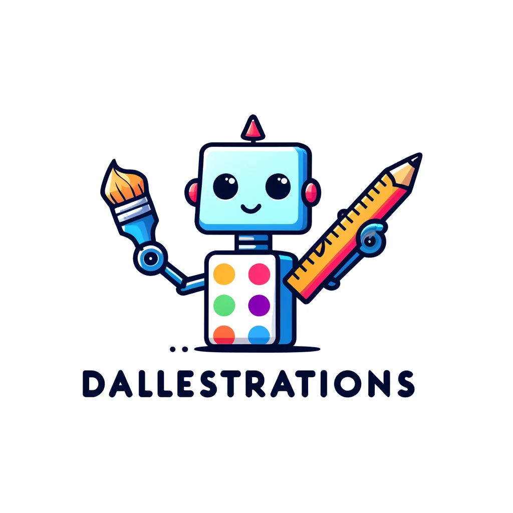

<p align="center">
  
</p>

<p align="center"><strong>Play it now at <a href="https://dallestrations.com">dallestrations.com</a></strong> 🎨</p>

Dallestrations is the AI-powered game of visual telephone — Telestrations,
but the drawing is done by an image model. Everyone writes a prompt, the AI paints it,
and the next player has to guess the prompt from the pictures alone. Their
guess gets painted too, and so on around the circle. At the end, the albums
reveal how gloriously wrong each idea went.

## How to play

1. [Create a room](https://dallestrations.com) and share the 4-letter code
   (or the QR code) with friends.
2. Everyone writes a starting prompt — the AI draws two interpretations of it.
3. Each round, you see the images your neighbor's words produced and guess
   what they wrote.
4. After the last round, gather around for the reveal.

Short on players? Add a bot — it writes its own prompts and genuinely guesses
from the images using a vision model. There's no scoring; the reveal is the
point.

## Architecture

The whole app is one Lambda function behind CloudFront, deployed with
[SST v3](https://sst.dev):

- **API + frontend in one function** — a streaming [Hono](https://hono.dev)
  app serves the JSON API and the built React SPA (React 19, Vite,
  Tailwind v4) from a single Lambda Function URL.
- **DynamoDB single-table** — a room's partition holds its metadata, players,
  and prompts. The prompt sort key `PROMPT#<round>#<playerId>` makes duplicate
  submissions structurally impossible, and round advancement is a conditional
  write, so concurrent submits are race-free.
- **Fast inference** — images come from FLUX on
  [Replicate](https://replicate.com) (a few seconds per prompt, generated
  synchronously on submit); bots use [Groq](https://groq.com) for prompt
  writing and vision guessing.
- **Polling, not websockets** — clients poll one `/state` endpoint every 2s.
  The poll is self-healing: it advances any round that's complete but
  un-advanced and re-runs missed bot turns under a short lease, so a crashed
  function can't strand a game.
- **S3** stores every generated image at a stable public URL.

## Development

```sh
npm install && (cd frontend && npm install)
npm run dev        # API on :3001 + Vite dev server, /api proxied
npm run typecheck
```

Create a `.env` with:

| Variable | Purpose |
|---|---|
| `GROQ_API_KEY` | bot prompt-writing and vision guesses |
| `REPLICATE_API_TOKEN` | FLUX image generation |
| `DYNAMODB_TABLE`, `S3_BUCKET` | resources from a deployed stage, for local API work |

Optional knobs: `GROQ_MODEL`, `GROQ_VISION_MODEL`, `IMAGE_MODEL`,
`IMAGES_PER_PROMPT`, `ART_MEGAPIXELS`.

## Deploy

```sh
npx sst deploy --stage dev      # personal stage, no custom domain
npm run deploy                  # production (attaches the custom domain)
```

## History

This is a rewrite of the original 2022 Dallestrations (Flask + Socket.IO +
DALL·E on Heroku — hence the name). Image generation used to take 30+ seconds
in a background thread; today's models are fast enough to paint on submit,
which let the whole realtime layer collapse into polling.
`scripts/migrate.ts` carried all the original games' albums over.
